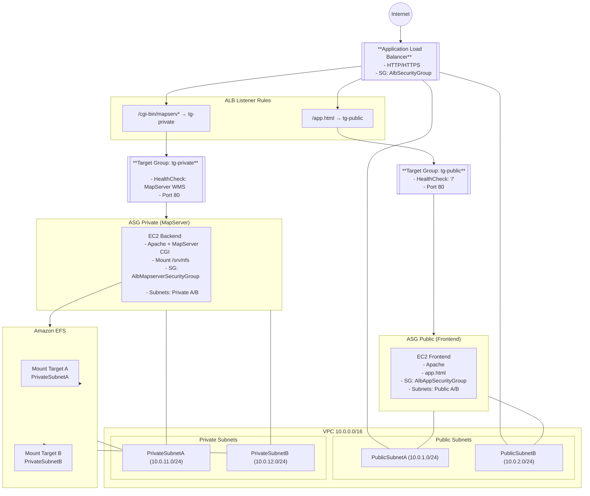

# MapServer on AWS — Full Infrastructure as Code (CloudFormation)

Ce projet déploie une architecture complète et scalable pour héberger **MapServer** sur AWS, entièrement automatisée via **CloudFormation**.  
L’objectif est de fournir une plateforme cartographique robuste, reproductible et auditable, avec séparation claire des composants réseau, sécurité, stockage et compute.

---

## 🚀 Architecture générale

L’infrastructure repose sur 4 stacks CloudFormation orchestrées par un **root stack** :
```bash
root.yml 
    ├── vpc.yml 
    ├── sg.yml 
    ├── efs.yml 
    └── lb-asg-tg.yml
```

Chaque stack est indépendante, exporte ses ressources critiques et peut être réutilisée dans d’autres environnements (dev, test, prod).

---

## 🧩 Composants principaux

### 1. **VPC (vpc.yml)**
- VPC 10.0.0.0/16  
- 2 subnets publics (AZ A/B)  
- 2 subnets privés (AZ A/B)  
- Internet Gateway  
- NAT Gateway pour les instances privées  
- Tables de routage dédiées  
- Exports : VPC ID, Subnets publics/privés

---

### 2. **Security Groups (sg.yml)**

| Security Group | Rôle | Règles |
|----------------|------|--------|
| **AlbSecurityGroup** | SG de l'application load balancer | HTTP/HTTPS depuis Internet |
| **AlbAppSecurityGroup** | SG des instances de la webapp | HTTP/HTTPS uniquement depuis le SG du LB |
| **AlbMapserverSecurityGroup** | SG des instances MapServer | HTTP/HTTPS uniquement depuis le SG du LB |
| **EFSSecurityGroup** | SG du EFS | NFS (2049) uniquement depuis le SG des instances MapServer |

Tous les SG sont exportés pour être réutilisés dans les autres stacks.

---

### 3. **EFS (efs.yml)**
- FileSystem chiffré  
- Mount Targets dans les 2 subnets privés  
- Sécurisé par le SG EFS  
- Export : FileSystemId  

L’EFS sert de **stockage partagé** pour :
- les données cartographiques  
- les fichiers `.map`  
- les shapefiles  
- les ressources statiques  

---

### 4. **Load Balancer + ASG + Launch Templates (lb-asg-tg.yml)**

#### 🔹 Application Load Balancer
- Listener HTTP (80)
- Listener HTTPS (443) optionnel
- Règles :
  - `/app.html` → Target Group Public
  - `/cgi-bin/mapserv*` → Target Group Private

#### 🔹 Auto Scaling Groups
- **ASG Public** : instances Apache servant `app.html`
- **ASG Private** : instances MapServer + montage EFS

#### 🔹 Launch Templates
- Installation automatique (Apache, MapServer, GDAL…)
- Montage EFS via `/etc/fstab`
- Initialisation automatique des données (shapefiles + mapfile)
- Activation du CGI MapServer
- Signalisation CloudFormation via `cfn-signal`

---

## 🌐 Fonctionnement global

1. L’utilisateur accède à :  
   **`http://<ALB-DNS>/app.html`**

2. La page Leaflet charge une couche WMS via :  
   **`http://<ALB-DNS>/cgi-bin/mapserv?map=/srv/nfs/mapfile/...`**

3. Le Load Balancer route automatiquement :
   - `/app.html` → instances publiques
   - `/cgi-bin/mapserv*` → instances privées MapServer

4. Les instances MapServer montent l’EFS et lisent :
   - les shapefiles
   - le fichier `.map`
   - les données partagées

---

## 🛠 Déploiement

### 1. Uploader les templates dans un bucket S3
```bash
- vpc.yml 
- sg.yml 
- efs.yml 
- lb-asg-tg.yml 
- root.yml
```
### 2. Déployer le root stack
```bash
# déploiement à partir du cloudshell de aws
         cd ~
         curl -L https://raw.githubusercontent.com/chocho11/testmapserveraws/main/stack/root.yml -o root.yml
         curl -L https://raw.githubusercontent.com/chocho11/testmapserveraws/main/stack/vpc.yml -o vpc.yml
         curl -L https://raw.githubusercontent.com/chocho11/testmapserveraws/main/stack/sg.yml -o sg.yml
         curl -L https://raw.githubusercontent.com/chocho11/testmapserveraws/main/stack/efs.yml -o efs.yml
         curl -L https://raw.githubusercontent.com/chocho11/testmapserveraws/main/stack/lb-asg-tg.yml -o lb-asg-tg.yml

         BUCKET="testmapserver23666666" # name of your S3 bucket

         aws s3 cp ~ s3://$BUCKET/ --recursive # Uploading yml files to S3 bucket $BUCKET"

         aws cloudformation deploy --stack-name mapserver-root --template-file root.yml --parameter-overrides TemplateBucket=$BUCKET --region us-east-1 --capabilities CAPABILITY_NAMED_IAM
 ```  
 ```bash 
  📁 Les fichiers yml
/
├── vpc.yml
├── sg.yml
├── efs.yml
├── lb-asg-tg.yml
└── root.yml
``` 

🔒 Sécurité
- Instances MapServer non exposées à Internet
- Accès MapServer uniquement via l’ALB
- EFS accessible uniquement depuis les instances MapServer
- Séparation stricte public / privé
- IAM minimal (pas de rôles excessifs)

📌 Objectifs du projet
- Déployer MapServer de manière reproductible
- Fournir une architecture scalable et sécurisée
- Séparer proprement les responsabilités (réseau, compute, stockage)
- Faciliter l’audit et la maintenance
- Offrir une base solide pour des projets SIG plus avancés

📜 Licence
Libre d’utilisation et d’adaptation selon vos besoins.
 
🏛️ Architecture

